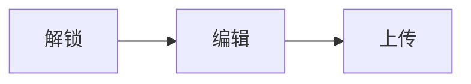

# Inkrypt 使用指南

Inkrypt 是一款基于 Passkey 的端到端加密笔记应用——你的笔记，只有你能看。

本文会带你走一遍完整流程：从创建保险库，到多设备同步、附件管理和冲突处理。

> ⚠️ **重要**：Inkrypt 不会保存你的主密钥。如果恢复码丢失且所有设备都无法解锁，数据将**无法找回**。

---

## 开始之前

### HTTPS 是必须的

生产环境必须使用 HTTPS（本地开发的 `localhost` 除外）。如果你自己部署，域名一旦确定就不要改——改了的话，已绑定的 Passkey 会失效。

### 浏览器兼容性

除了 WebAuthn（Passkey），Inkrypt 还需要 **PRF 扩展**。如果看到"不支持 PRF"的提示，请更新浏览器或换一个支持 PRF 的平台。

### 一个部署 = 一个保险库

首台设备创建保险库后，后续同一设备用「解锁」进入，其他设备通过「添加新设备」加入。不要重复点「创建保险库」。

---

## 1. 创建保险库（首次使用）

1. 打开首页，切换到「创建保险库」
2. 填个设备名称（比如"我的手机"），方便以后识别
3. 等页面显示"已准备就绪"，点「完成」
4. 按系统提示创建 Passkey（指纹/面容/安全钥匙）
5. 进入后，**立刻备份恢复码**：设置 → 恢复码 → 复制并离线保存

### 什么是恢复码？

恢复码就是你的主密钥。拿到它就能解密所有笔记。

- 只要还有一台设备能解锁，就不需要动用恢复码
- 但如果所有设备都丢了、恢复码也没备份，数据就真的没了

---

## 2. 日常解锁

1. 打开首页，切换到「解锁」
2. 点「解锁」，完成 Passkey 验证
3. 卡住了？点「重新准备」再试

### "记住解锁"功能

开启后 14 天内可以免 Passkey 进入，但**风险较高**：一旦浏览器被攻击（XSS/恶意扩展等），主密钥可能泄露。

建议：只在个人可信设备开启，用完记得点「锁定」。

---

## 3. 界面速览

### 导航

| 按钮 | 作用 |
|------|------|
| ⚙️ 设置 | 同步、新设备、恢复码、主题等 |
| 🔒 锁定 | 清除本地密钥，退出登录 |
| ➕ 新建 | 桌面端在左侧，移动端是悬浮按钮 |

### 搜索和标签

搜索支持标题、内容、标签。标签用英文逗号分隔，比如 `工作, 日记`。

### 编辑工具

- **收藏**：列表里会显示 ★
- **预览**：切换 Markdown 预览（桌面端分栏，移动端全屏）
- **目录**：显示文章大纲
- **附件**：管理图片和文件

---

## 4. 保存与同步

这是最容易混淆的部分，弄清楚能省很多麻烦：

| 类型 | 说明 |
|------|------|
| **本地自动保存** | 编辑时自动加密存到本地，防丢字。只在本机生效。 |
| **上传** | 把修改同步到云端。快捷键 `Ctrl/Cmd + S`。 |
| **从云端同步** | 拉取云端更新，不会自动上传你的修改。 |

**多设备建议流程**：先同步 → 再编辑 → 再上传

### 离线怎么办？

没网也能继续编辑（本地会自动保存）。但刷新后需要联网才能解锁，除非开了"记住解锁"。

---

## 5. Markdown 写作

支持完整的 Markdown 语法：

- GFM（表格、任务列表）
- 代码高亮
- 数学公式：`$...$` 行内，`$$...$$` 块级
- Mermaid 流程图

示例：

```markdown
## TODO
- [ ] 写点东西
- [x] 同步到云端

$$E = mc^2$$
```



---

## 6. 附件管理

附件会随笔记一起加密同步。

### 添加附件

- 点「附件」→「添加」
- 或者直接拖文件进附件面板
- 图片可以直接拖到编辑区，会自动插入引用

> 💡 建议单个附件控制在 1MB 左右，图片会自动压缩。

### 清理未引用附件

附件面板会提示有多少未被引用的附件，点「清理」即可删除。清理后记得上传同步。

> ⚠️ 出于安全考虑，SVG 不会内联渲染，但可以下载。

---

## 7. 添加新设备

换了新手机或新电脑？可以把它加入现有保险库。

### 在旧设备上

1. 设置 → 添加新设备
2. 复制配对口令（8 个英文单词），或让新设备扫码
3. 在有效期内完成配对（约 5 分钟）

### 在新设备上

1. 首页 → 添加新设备
2. 输入/粘贴配对口令（支持每个单词前 4 个字母），或点击“扫码输入”
3. 点「连接旧设备」
4. 两边都会显示 Emoji 指纹，**核对一致后**继续
5. 旧设备点「确认并发送密钥」，新设备点「创建 Passkey 并完成」

### 配对失败？

- 配对口令过期：回旧设备重新生成
- 不在同一个域名：确认访问的是同一个 Inkrypt 地址
- Emoji 不一致：立即取消，可能有中间人攻击

---

## 8. 设备管理

在设置里可以看到所有设备，支持：

- **重命名**：方便识别是哪台设备
- **移除**：撤销该设备的访问权限

注意：不能删除最后一台设备；移除当前设备会立即退出。

---

## 9. 冲突处理

两台设备同时编辑同一条笔记并上传，就会产生冲突。

**处理流程**：

1. 先「从云端同步」拿到最新版本
2. 在冲突窗口选择一个基线版本
3. 在"合并内容"里整理最终文本
4. 点「上传合并」

如果还提示冲突，再同步一次重试。

---

## 10. 安全提醒

| 要点 | 说明 |
|------|------|
| 恢复码即主密钥 | 拿到就能解密所有笔记，务必离线保管 |
| 配对不需要恢复码 | 新设备加入是通过设备间传输密钥 |
| 不要在公共设备展示恢复码 | 用完记得锁定 |
| 避免在共享设备开"记住解锁" | 风险太高 |
